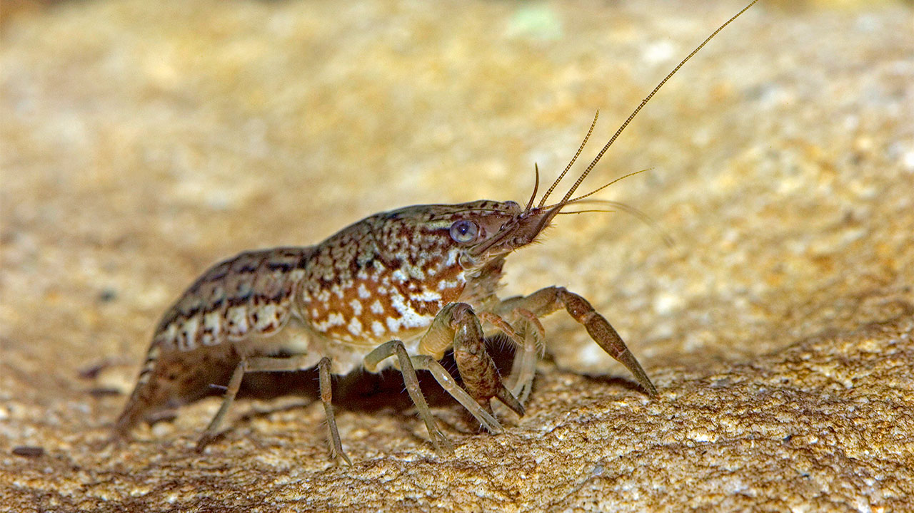

```{r setup2, include=FALSE}
knitr::opts_chunk$set(
	echo = FALSE,
	message = FALSE,
	warning = FALSE
)
packages_needed <- c("ggplot2", # graphics
                     "dplyr",
                     "arm", # display() etc.
                     "MASS",
                     "ggfortify",
                     "nlme",
                     "lme4",
                     "lmerTest",
                     "emmeans",
                     "ggtext",
                     "patchwork",
                     "pbkrtest",
                     "knitr"
                     )
pk_to_install <- packages_needed [!( packages_needed %in% rownames(installed.packages())  )]
if(length(pk_to_install)>0 ){
  install.packages(pk_to_install,repos="http://cran.r-project.org")
}
#lapply(packages_needed, require, character.only = TRUE)
library(ggplot2)
library(dplyr)
library(arm)
library(MASS)
library(ggfortify)
library(nlme)
library(lme4)
library(lmerTest)
library(emmeans)
library(ggtext)
library(patchwork)
library(pbkrtest)
library(knitr)


```


```{r import crayfish data, message=FALSE, warning=FALSE}
cray <- read.csv("crayfish/crayfish.csv")

cray <- cray %>%
  filter(Experiment.ID != "2") %>%
  filter(wW.g != "NA") %>%
  filter(TL.mm != "NA")

cray$Measurement.No.<- as.character(cray$Measurement.No.)

cray2 <- cray %>%
  filter(Measurement.No. != "9") %>% 
  filter(Measurement.No. != "8") %>%
  filter(Measurement.No. != "7") %>%
  filter(Measurement.No. != "6") %>%
  filter(Measurement.No. != "5") %>%
  filter(Measurement.No. != "4") %>%
  filter(Measurement.No. != "3")

cray3 <- cray %>%
  group_by(Measurement.No., Group.ID) %>%
  summarise(mean_wt = mean(wW.g),
            mean_tail = mean(TL.mm))
                             

```


# Marbled Crayfish (*Procambarus virginalis*) Example

**This dataset looks at the growth of juvenile marbled crayfish in response to infection trials of the crayfish plague pathogen *Aphanomyces astaci*. Groups were continuously exposed to 1 of 3 concentrations of *A.astaci* every two weeks and their wet weight and total length were recorded before each infection trial. Infection doses included: None. 7500 zoospore/mL. 15000 zoospore/mL. Marbled Crayfish are the also the only known obligate parthenogen among the Decapoda Order of crustaceans which includes 15,000 species. They have become an invasive nuisance because they rapidly reproduce and are common carriers of the crayfish plague pathogen **





## Plots


### Raw data


```{r plot the raw crayfish data, message=FALSE, warning=FALSE}
ggplot(cray, aes(x= Measurement.No., y=wW.g, group= Group.ID, color=Group.ID)) +
  geom_line(aes(group=Animal.ID)) +
  geom_point(size = 1) +
  labs(title = "Effect of Aphanomyces astachi on Crayfish", x="Measurement", y = "Weight (grams)",
          subtitle = "n = 55 participants") 

```


### Mean Data


```{r plot the mean crayfish data, message=FALSE, warning=FALSE}
ggplot(cray3, aes(x= Measurement.No., y=mean_wt, group= Group.ID, color=Group.ID)) +
  geom_line(aes(group=Group.ID)) +
  geom_point(size = 2) +
  labs(title = "Effect of Aphanomyces astachi on Crayfish", x="Measurement", y = "Mean Weight (grams)",
          subtitle = "n = 55 participants") 

```


```{r plot the mean crayfish data2, message=FALSE, warning=FALSE}
ggplot(cray3, aes(x= Measurement.No., y=mean_tail, group= Group.ID, color=Group.ID)) +
  geom_line(aes(group=Group.ID)) +
  geom_point(size = 2) +
  labs(title = "Effect of Aphanomyces astachi on Crayfish", x="Measurement", y = "Mean Length (mm)",
          subtitle = "n = 55 participants") 

```


# Models


## Mixed Model


```{r fit mixed model, echo=TRUE, message=TRUE}

lmeModel <- lmer(wW.g ~ Group.ID*Measurement.No. + (1|Animal.ID), data=cray)
anova(lmeModel)

```


### Model Summary


```{r check mixed model, message=FALSE, warning=FALSE}
#note new syntax for model specification
summary(lmeModel)
#notice that the default for mixed models has slightly different output than normal OLS model.
```


### Model Performance


```{r check crayfish model, fig.height=9, fig.width=9.5, message=FALSE, warning=FALSE}
performance::check_model(lmeModel)
```


# Estimated Marginal Means


```{r fit emmeans from model - each machine, echo=TRUE, message=FALSE, warning=FALSE}
#calculate model-adjusted means (e.g. estimated marginal means)
cray_emm <- emmeans(lmeModel, "Measurement.No.", "Group.ID")

```


```{r emmeans as dataframe}
data_emm <- as.data.frame(summary(cray_emm))
#data_emm <- as.data.frame(summary(mixed_animals_emm))[c('season', 'species', 'emmean', 'SE')] #specify columns to print
data_emm
#model-adjusted means (emm) are identical to raw means (see above) since nothing really being adjusted in fully balanced experiment.
```


## Raw Means


```{r summarize animal data and plot, message=FALSE, warning=FALSE, paged.print=TRUE}
means <- cray %>%
  group_by(Measurement.No., Group.ID) %>%
  summarise(mean_weight=mean(wW.g),
           se_weight=sd(wW.g)/sqrt(n()))

means$Measurement.No.<- as.factor(means$Measurement.No.)

means$Group.ID <- as.factor(means$Group.ID)
          
kable(means[1:27, ], caption = 'Table 1. Raw Means.')

```


## Raw vs Marginal Means


```{r plot raw vs emmeans, message=FALSE, warning=FALSE}


p<- ggplot(data_emm, aes(x= Measurement.No., y=emmean, group=Group.ID, color=Group.ID)) + 
  geom_line() +
  geom_point(size=1.5)+
  geom_errorbar(aes(ymin=emmean-SE, ymax=emmean+SE), width=.3)+
  labs(title="Weight Per Measurement (marginal means +/- 1 SE)", x="Measurement", y = "Mean Weight (grams)")


p2 <- ggplot(means, aes(x= Measurement.No., y=mean_weight, group= Group.ID, color=Group.ID)) +
  geom_line(aes(group=Group.ID)) +
  geom_point(size = 1.5) +
  geom_errorbar(aes(ymin=mean_weight-se_weight, ymax=mean_weight+se_weight), width=.3)+
  labs(title = "Weight Per Measurement (raw means)", x="Measurement", y = "Mean Weight (grams)")

p/p2

```


# Pairwise contrasts

**Results may be misleading due to involvement in interactions**

## Between groups


```{r pairwise contrasts BETWEEN groups, echo=TRUE, message=FALSE, warning=FALSE}
pairs(emmeans(lmeModel, "Group.ID")) 
```


## Between measurments


```{r pairwise contrasts BETWEEN measurements, echo=TRUE, message=FALSE, warning=FALSE}
pairs(emmeans(lmeModel, "Measurement.No."))
```


